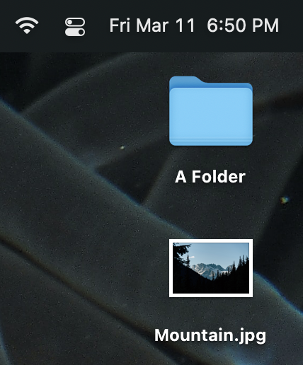
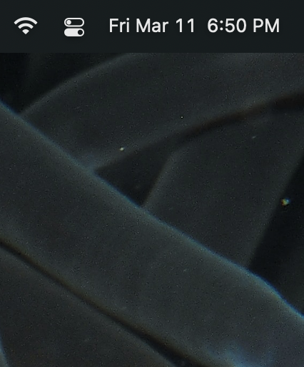

   

<h3 align="center"> 
   <strong style="">Toggle Desktop Visible</strong>
    
</h3>

  
    A Raycast Toggle Desktop Visible Extension. Use very easy.
  

---

You can toggle the Desktop file and folder Show and Hidden. Sometimes we don't want to see the Desktop have too many files or folders,
So this extension can help you. You can easily switch Desktop visible state, Enjoy a clean desktop wallpaper.

### Show Desktop

### Hidden Desktop

